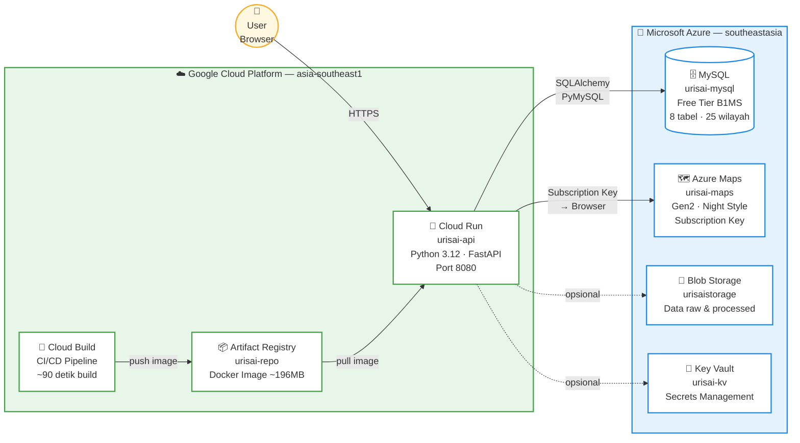
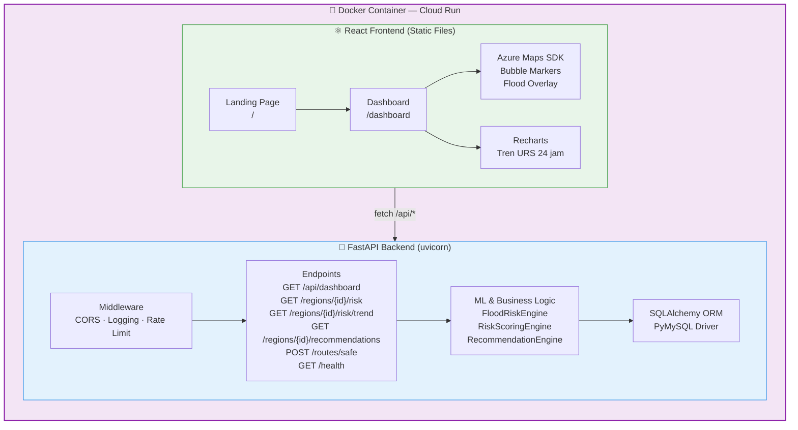
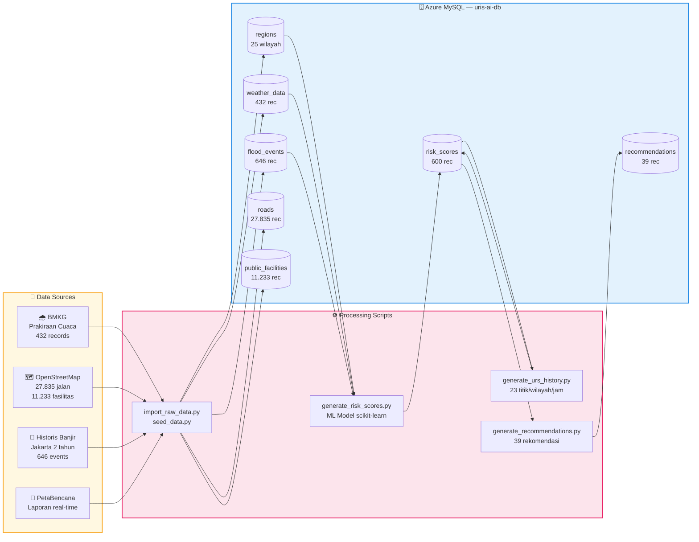
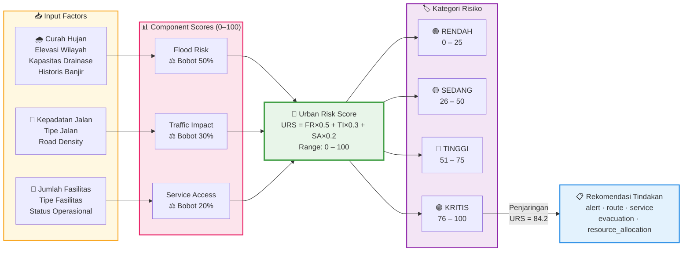
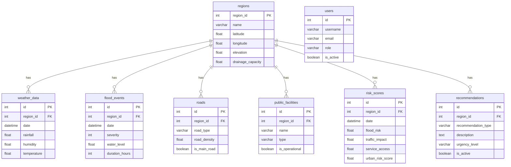

# URIS-AI System Architecture

## 1. System Overview

---

## 2. Application Stack (Docker Container)

---

## 3. Data Pipeline

---

## 4. Urban Risk Score — Calculation Flow

---

## 5. CI/CD Deployment Pipeline

```mermaid
graph LR
    DEV(("💻\nDeveloper"))

    subgraph LOCAL["🖥️ Local"]
        BUILD_FE["npm run build\nReact → static/"]
        CODE["Source Code\n+ Dockerfile\n+ .gcloudignore"]
    end

    subgraph GCP_BUILD["☁️ GCP Cloud Build"]
        UPLOAD["Upload Source\n~104 files · 9.4 MB"]
        DOCKER["Docker Build\npython:3.12-slim\npip install ~35 pkg\n~90 detik"]
        PUSH["Push Image\n~196 MB"]
    end

    subgraph REGISTRY["📦 Artifact Registry"]
        IMAGE["urisai-api:latest\nsha256:xxxx"]
    end

    subgraph CLOUDRUN["🚀 Cloud Run"]
        REV["New Revision\nHealth Check ✓"]
        TRAFFIC["Traffic 100%\nLive!"]
    end

    LIVE(("🌐\nLive URL\nhttps://\nurisai-api-\nzgwts4p3va-\nas.a.run.app"))

    DEV --> BUILD_FE
    BUILD_FE --> CODE
    CODE -->|"gcloud builds submit"| UPLOAD
    UPLOAD --> DOCKER
    DOCKER --> PUSH
    PUSH --> IMAGE
    IMAGE -->|"gcloud run deploy"| REV
    REV --> TRAFFIC
    TRAFFIC --> LIVE

    style LOCAL fill:#fff8e1,stroke:#f9a825,stroke-width:2px
    style GCP_BUILD fill:#e8f5e9,stroke:#43a047,stroke-width:2px
    style REGISTRY fill:#e8f5e9,stroke:#43a047,stroke-width:2px
    style CLOUDRUN fill:#e8f5e9,stroke:#43a047,stroke-width:2px
    style LIVE fill:#e3f2fd,stroke:#1e88e5,stroke-width:3px
```

---

## 6. Database Schema (ER Diagram)

---

## Cara Render Diagram

Diagram di atas menggunakan **Mermaid syntax** yang otomatis dirender menjadi visual di:

| Platform         | Cara                                                 |
| ---------------- | ---------------------------------------------------- |
| **GitHub**       | Buka file `.md` di repo — otomatis render            |
| **VS Code**      | Install extension "Markdown Preview Mermaid Support" |
| **Notion**       | Paste ke code block, pilih bahasa `mermaid`          |
| **Mermaid Live** | https://mermaid.live — paste dan export PNG/SVG      |
| **draw.io**      | Import via Extras → Edit Diagram                     |

> Untuk presentasi: buka https://mermaid.live, paste tiap diagram, export sebagai PNG beresolusi tinggi, lalu masukkan ke slide PowerPoint.

---

_URIS-AI · Urban Risk Intelligence System · 2026_  
_Live: https://urisai-api-zgwts4p3va-as.a.run.app_  
_GitHub: https://github.com/rathaavle/uris-ai_
